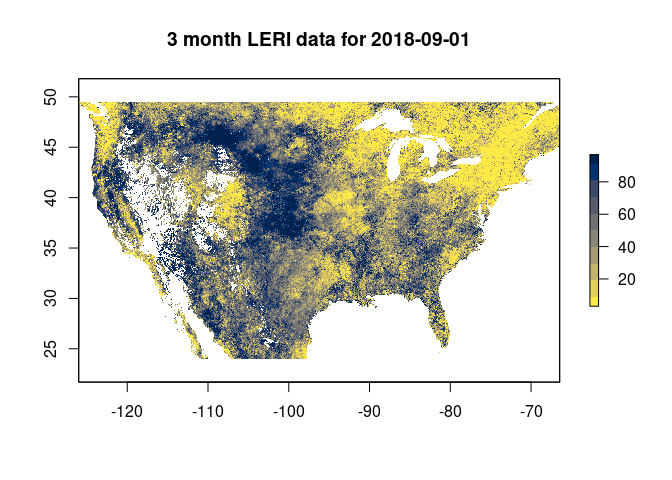

<!-- README.md is generated from README.Rmd. Please edit that file -->

# leri: R package for the NOAA Landscape Evaporative Response Index

[](https://cranchecks.info/pkgs/leri)
[](https://cran.r-project.org/package=leri)
[](https://circleci.com/gh/earthlab/leri/tree/master)
[](https://ci.appveyor.com/project/earthlab/leri)
[](https://codecov.io/gh/earthlab/leri)
[](https://zenodo.org/badge/latestdoi/160896497)
[](https://github.com/metacran/cranlogs.app)

The leri R package facilitates access to the NOAA [Landscape Evaporative
Response Index](https://psl.noaa.gov/leri/) data product.

## Installation

You can install the development version of leri with devtools:

``` r
# install.packages("devtools")
devtools::install_github("earthlab/leri")
```

Or, you can install the stable version from CRAN:

``` r
install.packages("leri")
```

## Example

The LERI product is available from the year 2000 to present at a 1 km
spatial resolution over the continental United States, at the following
timescales:

-   1, 3, 7, and 12 month
-   8 day accumulated or non-accumulated during the growing season
    (April - Oct.)

If we were interested in medium term drought, we could get 3 month
timescale LERI data for a particular date as follows:

``` r
library(leri)
r <- get_leri(date = "2018-09-01", product = "3 month")
r
#> class      : RasterLayer 
#> dimensions : 2844, 6617, 18818748  (nrow, ncol, ncell)
#> resolution : 0.009, 0.009  (x, y)
#> extent     : -126.009, -66.456, 23.949, 49.545  (xmin, xmax, ymin, ymax)
#> crs        : +proj=longlat +datum=WGS84 +no_defs 
#> source     : memory
#> names      : LERI_03mn_20180901.nc 
#> values     : 3.125, 96.87499  (min, max)
```

The `get_leri` function will download the NetCDF files from the NOAA ftp
server and read them as `RasterStack` objects, which facilitates any
other operations that users may need via the `raster` package. For
example, we could plot the data using the `raster::plot` function:

``` r
library(raster)
#> Loading required package: sp
library(viridis)
#> Loading required package: viridisLite

plot(r, col = cividis(10, direction = -1), 
     main = "3 month LERI data for 2018-09-01")
```



## LERI Resources

More information on the creation and recommended usage for LERI can be
found here: <https://www.esrl.noaa.gov/psd/leri/>

Other potentially useful resources include:

-   [Poster about the LERI product
    (pdf)](https://www.esrl.noaa.gov/psd/leri/resources/pdf/LERI_Poster_CPASW-2018_Final.pdf)
-   [Slides about the LERI product
    (pdf)](https://www.esrl.noaa.gov/psd/leri/resources/LERI_Rangwala_NIDIS-BrownBag_092418_PDF.pdf)
